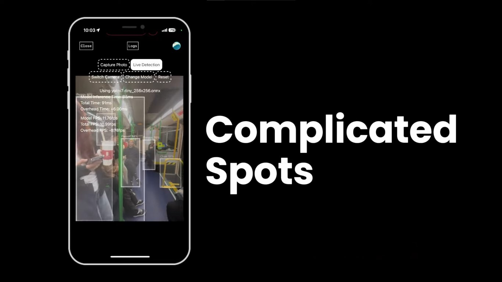
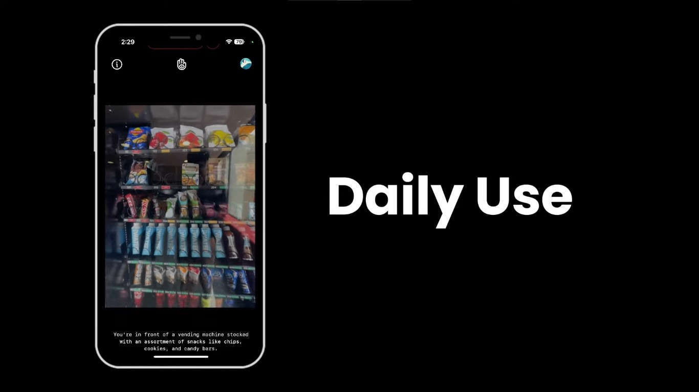
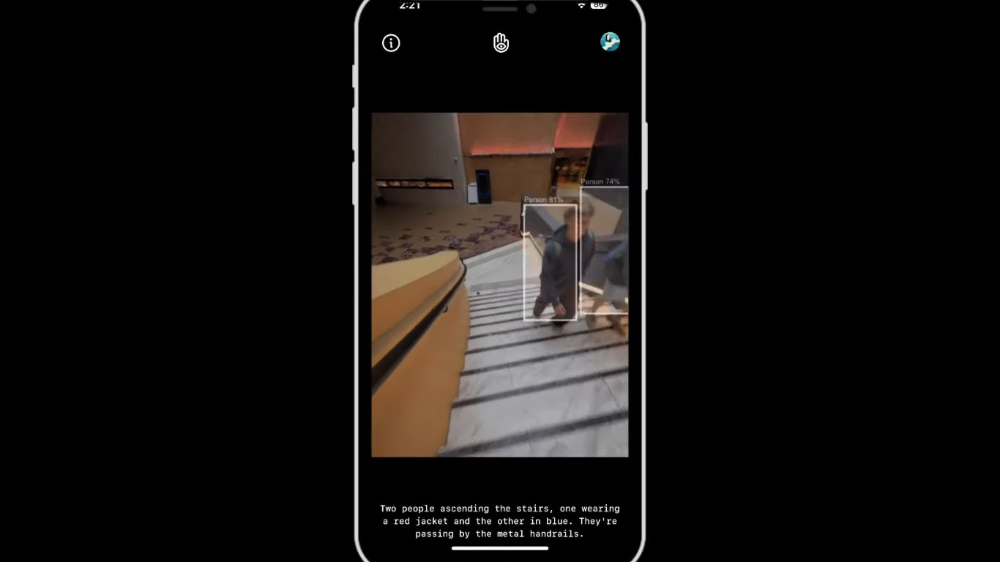

# Your Eyez: An AI-powered vision aid

[Click to watch Demo](https://youtu.be/1F4wq1y6iRo&t=80s)

## Pictures







## Overview

Welcome to **Your Eyez**, an innovative app designed to help visually impaired individuals navigate their world with confidence. By harnessing the power of advanced AI technologies, Your Eyez provides real-time audio feedback, painting a vivid picture of the surroundings.

## 🏆 What we accomplished?

We achieved real-time object detection with a latency of just ~100ms by optimizing YOLOv7 models. Our team built this solution with a focus on performance, accuracy, and accessibility.

## 👷‍♂️ Architecture and Framework

1. Next.js for server-side rendering and static site generation.
2. TypeScript for strong typing.
3. TailwindCSS for utility-first styling.
4. Clerk for authentication.

## 🤖 AI Technologies

1. YOLOv7 for real-time object detection.
2. GPT-4 Vision for advanced scene understanding.
3. ONNX (Open Neural Network Exchange) format for machine learning model deployment.

## 🔉 Audio Processing and Text-to-Speech (TTS):

1. Custom AudioGenerator class for managing audio playback priorities.
2. PriorityQueue for efficient audio scheduling.
3. Dual-voice system ("a" and "b") for varied audio feedback.

## Core Technologies

- **Object detection with YOLOv7**: Identifies and tracks objects in real-time, offering crucial information about obstacles and points of interest.
- **Computer Vision with GPT-4 Vision**: Delivers insightful and contextual descriptions of the scene, capturing details beyond simple object recognition.
- **Audio Generation with Deepgram**: Converts text into natural-sounding speech using state-of-the-art text-to-speech technology.

## Local Development Setup

**1. Clone the repository:**

```bash
git clone https://github.com/abdularif0705/youreyez.git
```

**2. Install dependencies:**

```bash
pnpm install
```

**3. Set up environment variables:**

Create a .env.local file in the root directory and add the following variables:

```
OPENAI_API_KEY=your_openai_api_key
DEEPGRAM_API_KEY=your_deepgram_api_key
CLERK_API_KEY=your_clerk_api_key
CLERK_FRONTEND_API=your_clerk_frontend_api
```

**4. Run the development server:**

```bash
pnpm dev
```

**5. Access the application:**

Open http://localhost:3000 in your browser.

## Usage

1. **Sign in/Sign up**: Authenticate with Clerk to access the application.
2. **Start the app**: Press the "Start" button to initiate object detection and scene description.
3. **Audio feedback**: The app will announce detected objects and provide contextual descriptions of the scene.
4. **Manual trigger**: Swipe up to manually request a scene description.
5. **Mute irrelevant phrases**: Swipe down to mute audio feedback for specific phrases.

## Features

- **Real-time Object Detection**: Identifies and announces objects like people, furniture, vehicles, and potential hazards.
- **Contextual Scene Descriptions**: Provides rich narratives about the surrounding environment, including details such as layout, atmosphere, and activities.
- **Customizable Audio Feedback**: Adjust the volume, voice, and frequency of audio cues to personalize your experience.
- **Intuitive Interface**: Easy-to-use gestures allow for seamless interaction and control over the app's functionalities.

## Benefits

- **Enhanced Independence and Mobility**: Navigate your environment with greater confidence and safety.
- **Improved Situational Awareness**: Gain a deeper understanding of your surroundings, fostering a sense of connection and engagement with the world.
- **Greater Accessibility**: Participate in activities and experiences that may have previously been challenging.

## Future Development

- **Integration with Other Sensors**: Incorporate data from additional sensors like LiDAR or depth cameras for a more comprehensive understanding of the environment.
- **Offline Capabilities**: Access core features even without an internet connection.
- **Multilingual Support**: Expand language options for audio feedback to cater to a wider audience.
- **Open-source Development**: Foster community involvement and collaboration to further enhance the app's capabilities.

We are excited about the possibilities that Your Eyez holds and are committed to its continued development and improvement.

Join us in building a future where everyone can see the world through Your Eyez.
